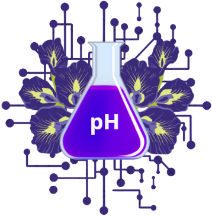
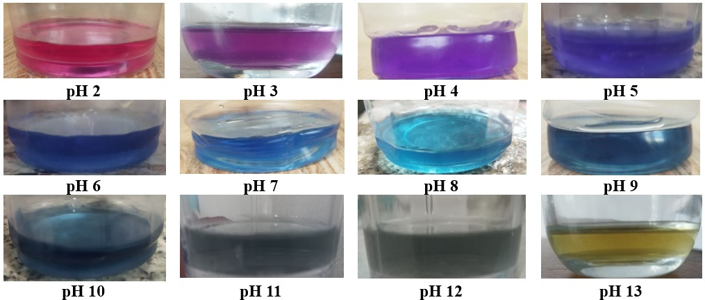
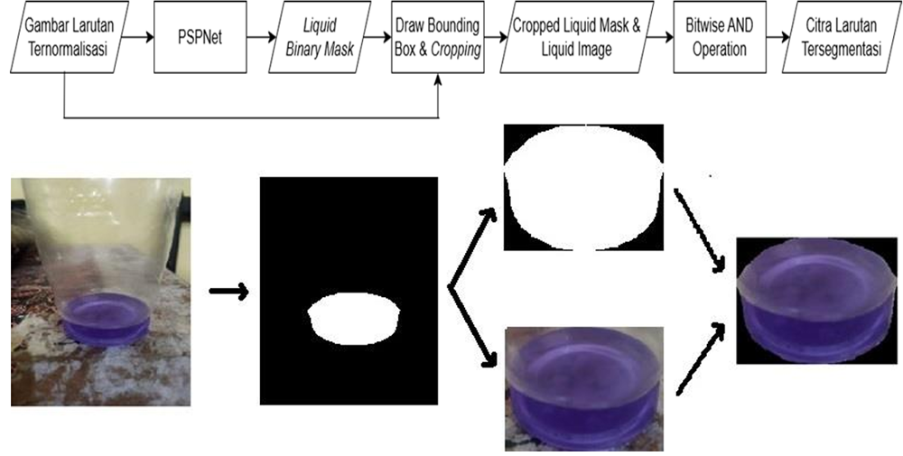
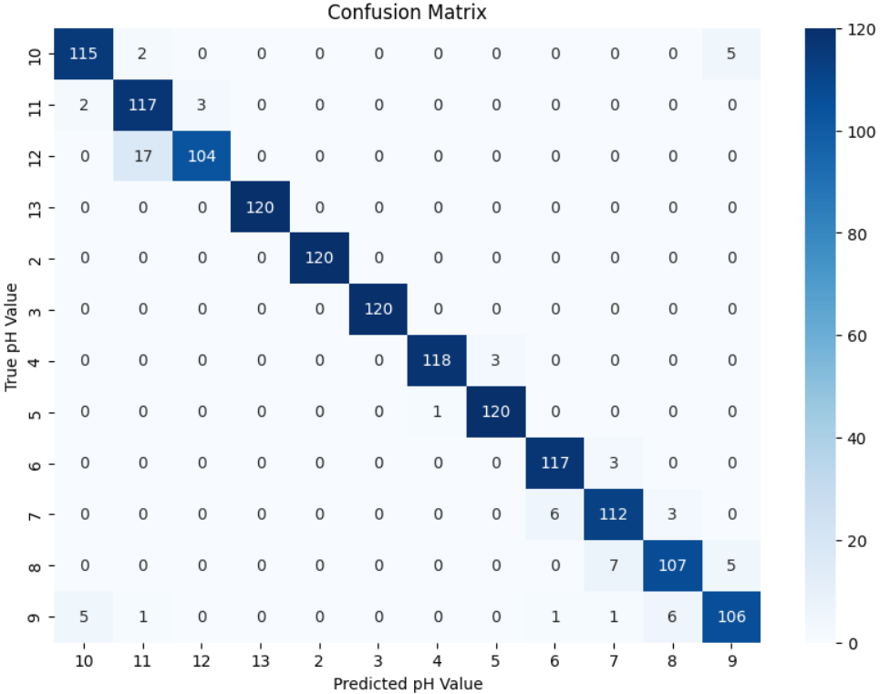
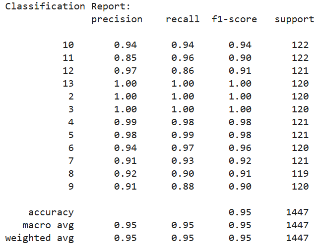

# TelangPH.AI
<p align="center">
  
</p>

## Introduction

TelangPH.AI is an AI-powered pH prediction system that utilises Butterfly Pea Flower as a pH indicator. This project aims to develop an affordable alternative to conventional pH measurement tools by harnessing the potential of natural pH indicators. As a pH indicator, Butterfly Pea Flower extract has the ability to change colour when mixed with other liquids that have different pH values due to its anthocyanin content. The colour change in the extract mixture is the main characteristic of the pH value.

## Technologies

- [](https://www.python.org/)
- [](https://numpy.org/)
- [](https://opencv.org/)
- [](https://pytorch.org/)
- [](https://onnx.ai/)
- [](https://huggingface.co/)
- [](https://www.docker.com/)
- [](https://fastapi.tiangolo.com/)

## Dataset

- **Description:** : The dataset consists of images of Buffer solutions with a pH range of 2 to 13 that have been mixed with butterfly pea flower extract and placed in clear glasses, resulting in variations in the colour of the extract at different pH values. This dataset contains a total of ± 7,200 images, with ± 600 images for each pH value.

- Color variation of Butterfly Pea Flower Extract in pH 2 - 13 :



**Source:** [Dataset Link](https://drive.google.com/drive/folders/1AEW6-xGKV9tvNPNj_pVaIWmhBnf2tzi3?usp=sharing)

## Model Architecture
The process of pH prediction consists of 2 main steps :

**1. Liquid Segmentation**

Liquid segmentation is intended to segment out just the butterfly pea flower extract solution from the image.. The segmentation process involves a pre-trained Pyramid Scene Parsing Network (PSPNet) model to perform semantic segmentation on the solution, adopted from the research by Eppel et al., 2020 (https://doi.org/10.1021/acscentsci.0c00460).



**2. pH Classification**

The Tiny Swin Transformer model is used to classify segmented solution images into their corresponding pH values, achieved by fine-tuning all layers of the model using the collected dataset

## Result
<p align="center">
  
</p>
<p align="center">
  
</p>

**Train Accuracy : 0.98**

**Validation Accuracy : 0.95**

**F1-Score for every pH value >= 0.90**

## Dependencies

- Install [Docker](https://docs.docker.com/get-docker/)

- Clone this repository :
```bash
git clone https://github.com/satyananda03/TelangPH.AI
cd TelangPH.AI
```
- Build Docker Image
```bash
docker build -t ph-prediction-app .
```
- Run the Container
```bash
docker run -p 8000:8000 ph-prediction-app
```
- Access the API Endpoint 
```bash
http://localhost:8000/docs
```

## Future Improvement 

- Cloud deployment

- MLOps integration

- User Interface (UI) to consume the API